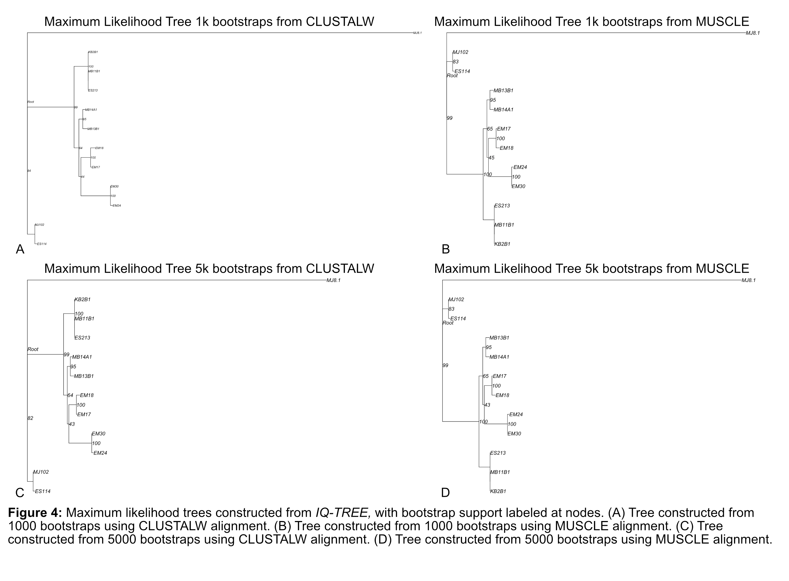
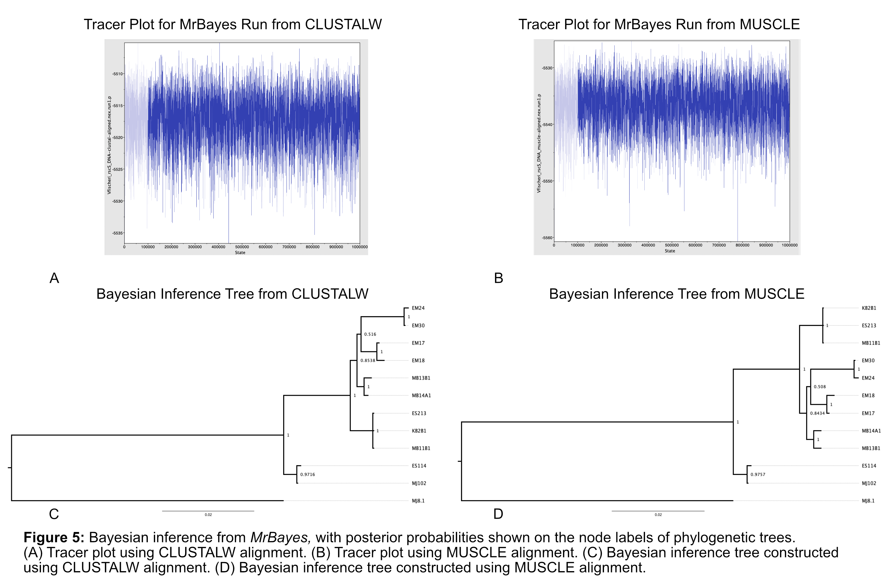

# Construction and comparison of phylogenetic trees by diverse software methods for 12 *Vibrio fischeri* strains from the *rscS* locus consistently identifies Group A as phylogenetically related

Avery Imes

## Abstract 
Requirements: Concisely & clearly covers all key components in 200 words or less: biological rationale, hypothesis, approach, result direction & conclusions

## Introduction

Many animal tissues are colonized by diverse microbial communities. The complexity of these communities can make mechanistic studies of colonization challenging. To ask how microbe and host communicate to establish reproducible associations during each host generation, it is valuable to use a natural binary model such as the squid-vibrio system to conduct focused molecular studies. Hawaiian bobtail squid (*Euprymna scolopes*) have a light organ that is colonized exclusively by bioluminescent *Vibrio fischeri* despite tremendous bacterial diversity in the surrounding seawater (Ruby et al. 1992). The bacterial light obscures the squid shadow through counterillumination, protecting the squid from nocturnal predators (Jones et al. 2004). Bobtail squid are born without symbionts and then acquire *V. fischeri* from seawater after hatching, making the system amenable to studies investigating how bacteria specifically and reproducibly colonize animal hosts. While it is clear that only *V. fischeri* bacteria colonize the light organ, the considerable variation in colonization fitness among *V. fischeri* strains is poorly understood.

Among the tremendous strain diversity capable of colonizing the squid light organ are a group of strains, called “Group A” *V. fischeri*, which are hypercompetitive and become dominant during host colonization through unknown mechanisms (Wollenberg et al. 2012). Previous studies found that “Group B” *V. fischeri*, the majority of squid-colonizing bacteria, strictly require a gene called *rscS* to colonize squid (Rotman et al. 2019). RscS is a hybrid histidine kinase that acts as an activator of the biofilm system that is essential for colonization. All known Group A strains  were thought to have a nonfunctional *rscS* gene due to a frameshift mutation, yet still require that same biofilm system for colonization, suggesting they have evolved a more effective regulatory mechanism (Rotman et al. 2019). I have observed, however, significant differences within the *rscS* locus between strains that may indicate greater diversity in this gene than previously known. 

The phylogenetic relationship of these strains, particularly the Group A strains, remains unclear. While the Mandel Lab has previously published a phylogenetic tree of some *V. fischeri* strains based on the *recA* locus (Rotman et al. 2019), this tree does not capture the full diversity present in our strain collection nor account for the phylogenetic data likely present in symbiosis-relative gene loci. In this paper, I aimed to use the symbiosis-associated *rscS* gene of a small selected group of strains to explore a variety of phylogenetic analysis techniques; I aimed to determine if trees constructed from *rscS* mirrored earlier tree constructs using housekeeping genes, determine what significant differences if any may arise in tree construction depending on software selection, and screen various algorithms in order to eventually process a larger-scale dataset from our full strain collection. 

I hypothesize that *rscS* nucleotide sequences will allow for the production of phylogenetic trees that closely replicate the observed relationships from previous trees, meaning that *rscS* would be a good gene loci to reflect evolutionary divergence in relation to symbiosis. Particularly, I hypothesize that *rscS* will allow for the phylogenetic trees to tightly group the known Group A strains, which may allow for future analysis to quickly identify both unknown Group A strains and transitionary Group B to A strain candidates. While I expect all analysis methods to produce similar tree, I aim to identify one suitable to be scaled to hundreds of strains. 

To test these hypotheses, I will use the DNA nucleotide sequences for the *rscS* locus of 12 *V. fischeri* strains as the data input. To compare software methods, I will use a combinatorial approach of creating multiple sequence alignments (MSA) through two software methods, and then using both MSA files for 4 types of phylogenetic tree construction, being distance-based, parsimony-based, maximum likelihood estimations, and bayesian inference (Figure 1). 

##### Figure 1

## Materials and Methods

The exact software versions, commands and steps for the following methodology can be found in the [reproducible-script](/Users/aimes/Temp/PhyloGen563/scripts/reproducible_script_finalproject.md). 

In summary, I created two types of multiple sequence alignments (MSA) from nucleotide sequence input, described in more detail below. These two MSA files were used downstream to create 4 types of phylogenetic trees, being distance-based, parsimony-based, maximum likelihood estimations, and bayesian inference. This workflow is depicted in Figure 1.  

### Data Selection
The initial dataset is comprised of the DNA sequence encoding the *rscS* gene in 12 *V. fischeri* strains. The annotated gene region is sourced from a combination of publicly available NCBI sequences found under the corresponding strain name and private lab genome data from the Mandel Lab strain collection. All 12 sequences were compiled into a single fasta file. This data is found in the file [Vfischeri_rscS_DNAfasta.fasta](/Users/aimes/Temp/PhyloGen563/data/large_files/Vfischeri_rscS_DNAfasta.fasta). Among the 12 strains, strain MJ8.1 will be used as the outgroup for tree rooting; MJ8.1 has a highly divergent RscS protein from the other squid-symbiont strains, as MJ8.1 is a fish symbiont unable to colonize squid (Rotman et al. 2019).

### Creating Multiple Sequence Alignments Using MUSCLE and CLUSTALW
Using the input file specified above, I used the following two methods to create multiple sequence alignments. 

#### MUSCLE Alignment
I used MUSCLE, an iterative refinement algorithm which creates multiple sequence alignments through 3 stages (draft progressive alignment, improved progressive, and refinement) that aims to maintain the accuracy of comparable programs such as T-Coffee and CLUSTALW while being faster for scalability (Edgar 2004). MUSCLE uses Unweighted Pair-Group Method with Arithmetic Averaging (UPGMA) to cluster distance matrices, which the author reports improves results over Neighbor-Joining (NJ) approaches. I selected MUSCLE to compare with another alignment method, CLUSTALW, because of MUSCLE's strength in scalability. In the future, I aim to scale the methods detailed here to several hundred genomes. MUSCLE will be more efficient for that large dataset, and I want to compare here with a smaller dataset what significant- if any- differences may emerge from different alignment software. 

The user can define if the program should use the PPP algorithm or Super5 algorithm, as detailed in the supplementary material of MUSCLE documentation, to align sequences (Edgar 2004). Super5 is recommended within this document only for extremely large datasets, so I aligned with the PPP algorithm due to my small input dataset. All other MUSCLE parameters remained in their default setting. 

The input file for MUSCLE must be in FASTA format, and can be amino acid sequences or nucleotide sequences. The input file specified above, [Vfischeri_rscS_DNAfasta.fasta](/Users/aimes/Temp/PhyloGen563/data/large_files/Vfischeri_rscS_DNAfasta.fasta), contains 12 nucleotide sequences. The output file of the multiple sequence alignment from MUSCLE is stored in the file [Vfischeri_rscS_DNA_muscle-aligned.fasta](results/rscS_multiple-seq-alignments/Vfischeri_rscS_DNA_muscle-aligned.fasta). 

#### CLUSTALW Alignment
For the second alignment method, I chose CLUSTALW, a progressive alignment software which computes a rooted binary tree from pairwise distances to serve as a guide tree before building the multiple sequence alignment from the bottom up (Thompson et al. 1994). Unlike MUSCLE which uses UPGMA, CLUSTALW uses NJ to build trees; where UPGMA assumes a constant evolutionary rate, NJ allows for unequal evolutionary rates, which is thought to generate more accurate branch length estimates. I chose CLUSTALW to compare to MUSCLE due to this fundamental difference in tree building method, as I wanted to evaluate the difference in trees built from the two alignments and determine if significant differences arose in the resulting phylogeny depending on evolutionary rate estimate. An inherent limitation of progressive alignments such as CLUSTALW is the local minimum problem, where the software cannot correct early mistakes later and may produce incorrect branching order, and the issue of alignment parameters, where each step may have some misalignments that are more likely as sequences become more diverged. Due to the use of the same species and merely 12 strains in this analysis, I expect the sequences to be highly similar and unlikely to produce large percentages of misalignments within CLUSTALW. 

CLUSTAL2.0.12 does allow the user to specify clustering as either NJ or UPGMA, but due to my specific interest in comparing NJ in CLUSTALW to UPGMA in MUSCLE, I retained the default parameter of NJ clustering. All other parameters remained in their default. 

The input file for CLUSTALW must have all sequences in one file. Accepted files are NBRF-PIR, EMBL-SWISSPROT, 
Pearson (Fasta), Clustal (*.aln), GCG-MSF (Pileup), GCG9-RSF and GDE flat files. The input file I provided, as specified above, was [Vfischeri_rscS_DNAfasta.fasta](/Users/aimes/Temp/PhyloGen563/data/large_files/Vfischeri_rscS_DNAfasta.fasta). This file contains 12 nucleotide sequences. The output file of the multiple sequence alignment from CLUSTALW is stored in the file [Vfischeri_rscS_DNA-clustal-aligned.fasta](results/rscS_multiple-seq-alignments/Vfischeri_rscS_DNA-clustal-aligned.fasta). 

### Constructing Distance and Parsimony Based Phylogenetic Trees
Next, I input both MUSCLE and CLUSTALW generated multiple sequence alignments into both a distance-based tree package and parsimony-based package to evaluate the resulting trees. This section was all performed within RStudio. 

#### Estimating a Distance-Based Tree Using Software R Package _ape_
To construct a distance-based tree, I used the R package _ape_, which has a massive variety of functions for creating and analyzing phylogenetic trees, and was used here to create NJ-based distance trees (Paradis and Schliep 2019). I chose this software due to its many functions containing the necessary methods I wished to explore and the great flexibility due to its many user-defined parameters. Distance-based methods generally have an advantage over parsimony or maximum likelihood methods by producing an optimum tree without searching all the tree space, allowing an optimum tree regardless of scale. The major limitations, however, are that the approximation method of the software tends to approximate the optimum tree rather than truly achieve it. Distance methods are non-character-based, reducing information to one value per pair of sequences, and thus have less statistical power compared to character-based methods such as parsimony and maximum likelihood. This method does require the user to input a model of evolution, which can significantly impact the result. 

The data input must be a multiple sequence alignment. Uploading both the [Vfischeri_rscS_DNA_muscle-aligned.fasta](results/rscS_multiple-seq-alignments/Vfischeri_rscS_DNA_muscle-aligned.fasta) and the [Vfischeri_rscS_DNA-clustal-aligned.fasta](results/rscS_multiple-seq-alignments/Vfischeri_rscS_DNA-clustal-aligned.fasta), I first computed the genetic distances for both alignments using the Tamura and Nei 1993 model of evolution. This model assumes distinct rates for both kinds of transition and transversions, amd the base frequencies are not assumed to be equal and are estimated from the data. I selected this model due to the notably low GC content of *V. fischeri*, which may indicate unequal mutate rate bias between mutation types, and I thought the model could account for that. I then estimated NJ trees for both alignments from this model. 

I repeated the above steps, estimating NJ trees for both the CLUSTALW and MUSCLE aligned files, using a different model of evolution. For this estimate of genetic distances, I used the Galtier and Gouy 1995 model, which similarly assumes different rates for transitions and transversions but also accounts for GC content changing over time. I chose this model as it was newer and may have iteratively improved upon the Tamura and Nei 1993 model, preserving the unequal mutation rate I want while additionally focusing on the GC content that I find unusual in *V. fischeri*. 

All four of the resulting trees were ladderized, which reorganizes the internal structure of the tree for plotting, and rooted to the outgroup MJ8.1. The trees were then plotted in RStudio. 

#### Estimating a Parsimony-Based Tree Using Software R Package _phangorn_
To construct a parsimony-based tree, I used the R package _phangorn_, a multi-functional package that allows for estimation of phylogenetic trees using maximum parsimony among other methods (Schliep 2011). This program similarly allows for the user to define either UPGMA or NJ tree estimation. I chose NJ to maintain consistency with the _ape_ selection, so that differences in the trees would be due to parsimony-based estimations rather than NJ vs UPGMA differences. Unlike distance-based methods, parsimony-based methods are character-based and do not rely on models of evolution. These trees only aim to minimize the amount of evolutionary change required to explain the observed data. The major assumption of parsimony-based trees is independence among characters. In general, parsimony methods are most effective when the rate of evolution is slow, as the methods have long-branch attraction that can make the results inaccurate under high rates of evolution. I selected this method to serve as a comparison against the distance-based tree estimations, as I do not expect the computational limitations that make parsimony-based trees most useful to occur in my later projects, but I want to evaluate potential sources of deviation between phylogenetic inference techniques. 

The data input must be a multiple sequence alignment, similarly to _ape_. Uploading both the [Vfischeri_rscS_DNA_muscle-aligned.fasta](results/rscS_multiple-seq-alignments/Vfischeri_rscS_DNA_muscle-aligned.fasta)and the [Vfischeri_rscS_DNA-clustal-aligned.fasta](results/rscS_multiple-seq-alignments/Vfischeri_rscS_DNA-clustal-aligned.fasta), these files must then be converted to a phangorn object. For both MUSCLE and CLUSTALW objects, I created a starting tree to search the tree space through NJ-methods and estimated the parsimony score of that tree. For the MUSCLE-aligned sequences, the parsimony score was 373, comparable to the CLUSTALW parsimony score of 372. Both input types were then used to search for maximum parsimony trees. After 1nni operations, the MUSCLE-aligned DNA had a final p-score of 373 and CLUSTALW had a final p-score of 371. I rooted both the resulting trees to the outgroup MJ8.1 and plotted them in RStudio. 

### Estimating a Maximum Likelihood Tree Using IQ-TREE 
I used IQ-TREE, which is a stochastic algorithm to infer phylogenetic trees by maximum likelihood, combining elements of hill-climbing algorithms, random perturbation of best trees, and a broad sampling of initial starting trees (Nguyen et al. 2015, Minh et al. 2020). Despite it being computationally expensive, I chose this program because I have a small dataset that be manageable in the program, and IQ-TREE has been shown to achieve higher likelihoods than comparative programs such as RAxML. IQ-TREE does have several major assumptions: for DNA there must be 200-800 sequences, the alignment length must be at least 4x the number of sequences, and the proportion of gaps/unknown characters must be less than or equal to 70%. Note that one assumption is violated in this dataset, as only 12 sequences were provided. I thought this acceptable to trial-run and compare the phylogenic methods, as this will be corrected in future work with hundreds of sequences provided. Note that IQ-TREE will also discard identical sequences. 

For user-input, I provided both the MUSCLE and CLUSTALW multiple sequence alignment files. The software allows the user to input the model to be used; I used the built-in model finder function of the software to predict the best fit model for the data, which was HKY+F+G4 for both alignments. I specified this model selection for all runs of IQ-TREE. The user additionally must input the number of bootstraps to be done. For each alignment input, I ran IQ-TREE with 1000 bootstraps and 5000 bootstraps, generating 4 IQ-TREE outputs in total. All output files were saved to the [iq-tree-files](results/iq-tree-files) folder in the results directory. The resulting trees were visualized in RStudio. 

### Bayesian Inference of Phylogeny Using MrBayes
I used MrBayes to perform Bayesian inference of phylogeny on the multiple sequence alignment files, a program that uses a variant Markov Chain Monte Carlo (MCMC) to approximate posterior probability of trees (Huelsenbeck and Ronquist 2001, Ronquist and Huelsenbeck 2003). This software is capable of analyzing heterogenous data sets, has mixed models support, and model flexibility. The software does assume the user-provided priors are informative, and its limitations are in fact that there is no correct way to choose a prior, the posterior distributions heavily influenced by priors, and there are high computational cost in models with large number of parameters. The user must specify a model to be used, set a prior, and file inputs must be in nexus (.nxs) format.

I first converted both the MUSCLE and CLUSTALW alignment files to nexus (.nxs) files using the R packages _seqinr_ and as previously mentioned _ape_ (Charif and Lobry 2007, Paradis and Schliep 2019). I then created the necessary MrBayes block specifying the user-inputs, as detailed in the producible script, which was appended to each nexus file. The specific text block can also be found [here](scripts/mbblock.txt). The following notes the specified choices and a brief explanation if necessary: 

* nst=2 to specify HKY as the model, the same model used when running IQ-TREE to maintain model consistency between methods. 
* ngen=1000000 tells MrBayes that its robots should each take 1 million steps.
* samplefreq=100 specifies to only save parameter values and the tree topology every 100 steps.
* printfreq=1000 specifies a progress report every 1000 steps.
* nruns=3 says to just do three independent runs. MrBayes performs two separate analyses by default.
* nchains=3 says to have 2 heated chains running in addition to the cold chain.
* savebrlens=yes tells MrBayes to save branch lengths when it saves the sampled tree topologies.
* outgroup MJ8.1 specifies that strain as the outgroup to root the tree. 

All MrBayes output files can be found in the [mrbayes_output](results/mrbayes_output) folder within the results directory. The consensus tree files (con.tree) can then be converted from Nexus to Newick format in FigTree by exporting the files (Rambaut 2018). Exported Newick format files were then visualized in RStudio. 

## Results 

### Distance and Parsimony Trees 
The four distance-based trees produced by the *ape* package were highly similar, consistently matching the same strains into pairs and trios no matter the alignment software or evolution model used (Fig.2). In particular, the Group A strains KB2B1, MB11B1, and ES213 were identified as a closely evolutionarily related group distinct from other strains in the set (Fig.2). The trees produced by the Galtier and Gouy 1995 model had shorter branch lengths than trees produced by the Tamura and Nei 1993 model (Fig.2C, Fig.2D). 

##### Figure 2

The two parsimony-based trees produced by the *phangorn* package were identical no matter the MSA input (Fig.3). These cladogram-style trees created the same strain groups observed in all the distance-based trees (Fig.2). Again, the three known Group A strains were clustered together, though the parsimony-based trees put them at the end of the tree, indicating a recently emerged group (Fig.3). 

##### Figure 3

### Maximum Likelihood Trees
The four trees generated by IQ-TREE are highly similar to each other, and again highly congruent to the trees produced by previous methods, identifying the same strain groups as close relatives (Fig.4). The tree produced with 1000 bootstraps from the CLUSTALW MSA had a notably longer branch length for the outgroup MJ8.1 than other IQ-TREE produced trees (Fig.4). 

##### Figure 4

### Bayesian Inference Trees 
Tracer plots indicated proper mixing and convergence for both CLUSTALW and MUSCLE aligned input files (Fig.5A, Fig.5B). The two trees generated by MrBayes are highly similar between the CLUSTALW and MUSCLE MSA inputs, and again identified the same strain groups as all previous techniques (Fig.5C, Fig.5D). 

##### Figure 5

## Discussion 
Requirements: With a few minor exceptions, clearly, concisely, & logically presents all key components: interprets/integrates data; formulates argument for conclusions referring back to biological rationale & by comparing with relevant findings in literature, introduces new literature to discuss or support findings, evaluates methods, evaluates reliability of data, states knowledge generated & implications of results, suggests next investigation steps, includes unique observations, and ends paper with final conclusions

Using a combination of two multiple sequence alignment programs and four phylogenetic tree construction techniques, 12 phylogenetic trees were constructed using the *rscS* gene for 12 *V. fischeri* strains. Each tree generated extremely similar results, consistently identifying the same pairs and trio of most-related strains no matter the MSA input or analytic approach applied. Most importantly, all the techniques applied consistently paired the three known Group A strains, indicating that the methods applied here could be scaled up to probe the hundreds of strain isolates in our lab collection for other Group A strains. 

Despite the overall similarity between trees, a larger scale project would require refinement and determination of one pipeline to save computational costs. 

When selecting from phylogenetic tree construct techniques, the accuracy and scalability must be weighed. Overall, maximum likelihood, bayesian inference, and neighbor joining are statistically consistent methods, while techniques like UPGMA and maximum parsimony are not statistically consistent methods. To maintain statistical consistency, these methods should be removed from a large-scale pipeline, thus I would eliminate MUSCLE (which uses UPGMA) from the alignment stage and *phangorn* (which estimates maximum parsimony) from a future pipeline. This reduces the alignment stage to processing only through CLUSTALW, which uses NJ methods to create MSA files. 

Four things affect maximum likelihood estimate performance: the starting tree, the chosen model, the data, and convergence. 

## Literature Cited 
Charif, D., Lobry, J.R., 2007. SEQINR 1.0-2: A contributed package to the R project for statistical computing devoted to biological sequences retrieval and analysis. Structural Approaches to Sequence Evolution 207–232. doi:10.1007/978-3-540-35306-5_10 

Edgar, R.C., 2004. Muscle: Multiple sequence alignment with high accuracy and high throughput. Nucleic Acids Research 32, 1792–1797. doi:10.1093/nar/gkh340 

Huelsenbeck, J.P., Ronquist, F., 2001. Mrbayes: Bayesian inference of phylogenetic trees. Bioinformatics 17, 754–755. doi:10.1093/bioinformatics/17.8.754 

Minh, B.Q., Schmidt, H.A., Chernomor, O., Schrempf, D., Woodhams, M.D., von Haeseler, A., Lanfear, R., 2020. IQ-tree 2: New models and efficient methods for phylogenetic inference in the genomic era. Molecular Biology and Evolution 37, 1530–1534. doi:10.1093/molbev/msaa015 

Nguyen, L.-T., Schmidt, H.A., von Haeseler, A., Minh, B.Q., 2014. IQ-tree: A fast and effective stochastic algorithm for estimating maximum-likelihood phylogenies. Molecular Biology and Evolution 32, 268–274. doi:10.1093/molbev/msu300 

Paradis, E., Schliep, K., 2019. ape 5.0: An environment for modern phylogenetics and evolutionary analyses in R. Bioinformatics 35, 526–528. doi:10.1093/bioinformatics/bty633 

Rambaut, A., 2018. FigTreev1.4.4 [WWW Document]. Figtree. URL http://tree.bio.ed.ac.uk/software/figtree/ (accessed 5.6.24). 

Ronquist, F., Huelsenbeck, J.P., 2003. MrBayes 3: Bayesian phylogenetic inference under Mixed Models. Bioinformatics 19, 1572–1574. doi:10.1093/bioinformatics/btg180 

Rotman, E.R., Bultman, K.M., Brooks, J.F., Gyllborg, M.C., Burgos, H.L., Wollenberg, M.S., Mandel, M.J., 2019. Natural strain variation reveals diverse biofilm regulation in squid-colonizing *Vibrio fischeri*. Journal of Bacteriology 201. doi:10.1128/jb.00033-19 

Schliep, K.P., 2010. phangorn: Phylogenetic analysis in R. Bioinformatics 27, 592–593. doi:10.1093/bioinformatics/btq706 

Thompson, J.D., Higgins, D.G., Gibson, T.J., 1994. Clustal W: Improving the sensitivity of progressive multiple sequence alignment through sequence weighting, position-specific gap penalties and weight matrix choice. Nucleic Acids Research 22, 4673–4680. doi:10.1093/nar/22.22.4673 

## Reproducible Script 
See [reproducible_script_finalproject.md](/Users/aimes/Temp/PhyloGen563/scripts/reproducible_script_finalproject.md) file. 
